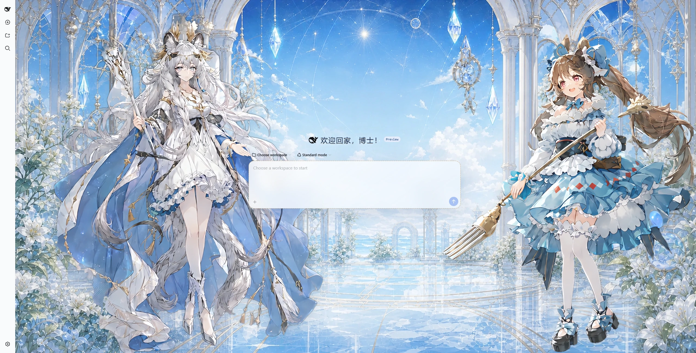

# 初雪和小羊

面向 DeepSeek Harness Web 的非官方、非商业明日方舟同人皮肤。主题以星海玻璃庭园为背景，左侧展示初雪，右侧展示艾雅法拉，并保留 DSH 官方原生侧栏。

[](preview/cover.webp)

## 功能

- 根据 DSH 明暗主题切换昼夜庭园背景；
- 首页展示独立透明双角色层，聊天页自动缩小至安全边缘；
- 响应侧栏宽度、首页与聊天状态以及不同视口尺寸；
- 将首页欢迎语显示为“欢迎回家，博士！”；
- 支持 `prefers-reduced-motion`，并在卸载时恢复全部 DOM、样式和观察器状态；
- 素材内嵌在构建产物中，运行时不加载远程图片。

## 安装

从仓库根目录执行：

```powershell
npx @deepseek-ai/dsh@0.1.0-rc.6 plugin --profile web add "<仓库路径>\dsh-arknights\skins\pramanix-eyjafjalla"
npx @deepseek-ai/dsh@0.1.0-rc.6 web
```

## 开发

```powershell
pnpm install
pnpm --filter dsh-arknights test
pnpm --filter dsh-arknights typecheck
pnpm --filter dsh-arknights build
```

## 许可

原创源代码采用 MIT License；美术素材采用 CC BY-NC-SA 4.0。角色、名称和相关知识产权归原权利方所有，详见 [NOTICE](NOTICE)。
